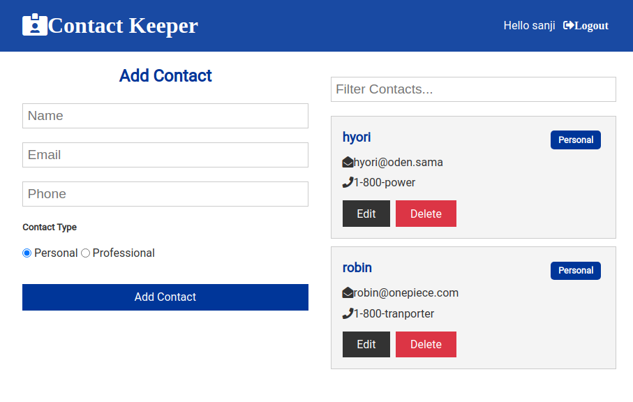

# MERN Contact App

> Project was about creating a Contact App that will allow the user to
> add, update, delete and filter contacts

> 

## Built With

- MongoDB
- React
- React-DOM
- Context
- Node
- Express

## Live Demo

[Live Demo Link](https://mighty-stream-12623.herokuapp.com/login)

## Getting Started

**To get a copy of the code please click on the green button on the top right corner that says Code**

### Prerequisites

- Node installed on your computer
- Npm as well

### Install

**Now to clone it to your local machine please open your terminal and paste this code `git@github.com:cvilla714/contact-keeper-mern-project.git`**

**Then you can go into the directory by typig `cd contact-keeper-mern-project`**

**Finally just type this command `npm install` this will install all of the dependecies for the project and you will need to do the same thing by typing `cd client` and run another `npm install` to finish installing all of the react scripts**

### Usage

**Once you have gone through the process of installing the code you now run this command from the terminal `npm run dev` this will start the app and a new window will open in your browser with the app ready to be use**

## Authors

👤 **Cosmel Villalobos**

- Github: [@cvilla714](https://github.com/cvilla714)
- Twitter: [@kckeyti](https://twitter.com/kckeyti)
- LinkedIn: [Cosmel Villalobos](https://www.linkedin.com/in/cosvilla/)

## 🤝 Contributing

Contributions, issues, and feature requests are welcome!

Feel free to check the [issues page](https://github.com/cvilla714/contact-keeper-mern-project/pulls).

## Show your support

Give a ⭐️ if you like this project!

## Acknowledgment

- Microverse
- Marc-Antoine Roy on Behance

## 📝 License

This project is [MIT](https://github.com/cvilla714/react-redux-capstone/blob/development/LICENSE) licensed.
